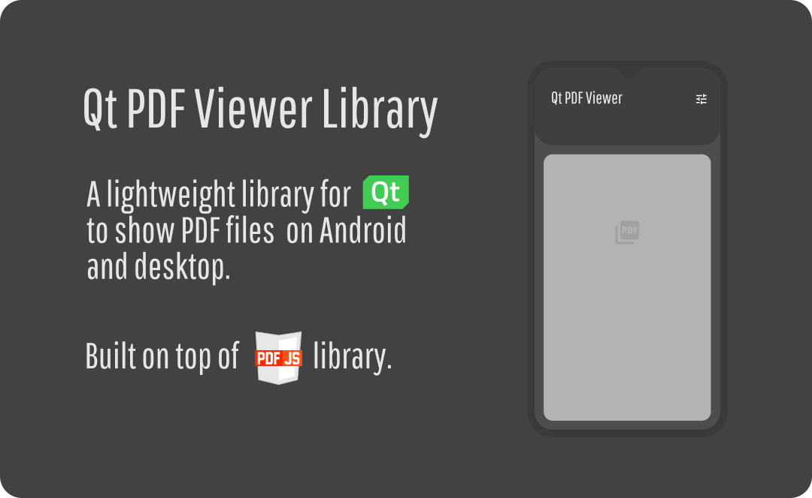
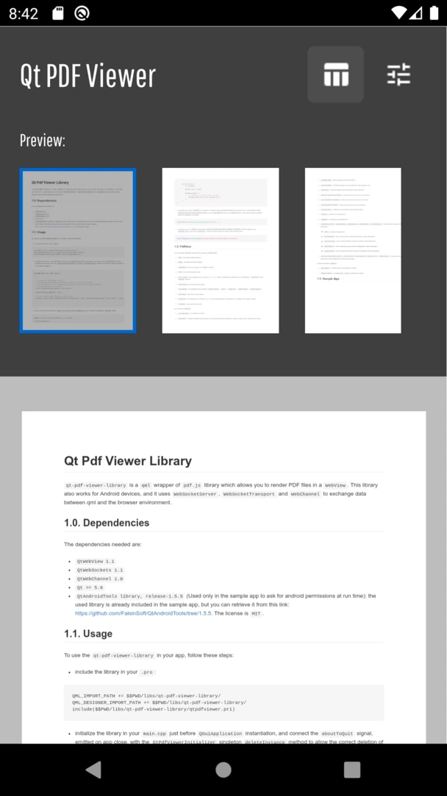

# Qt Pdf Viewer Library

[](https://github.com/develtar/qt-pdf-viewer-library/blob/master/LICENSE) [](https://github.com/develtar/qt-pdf-viewer-library/releases) [](https://github.com/develtar/qt-pdf-viewer-library/stargazers/)

  


The `qt-pdf-viewer-library` is a `qml` wrapper of `pdf.js` library which allows you to render `PDF` files in a `WebView`. This library also works for Android devices, and it uses `WebSocketServer`, `WebSocketTransport` and `WebChannel` to exchange data between qml and the browser environment.


## 1.0. Dependencies
The `qt modules` needed by the library are:
- `webchannel`
- `websockets`
- `webview`


#### 1.0.1. Libraries
The libraries used to create the `qt-pdf-viewer-library` are:
- `PDF.js` version `2.0.550` (`Apache License 2.0`): you can retrieve it from this link: https://github.com/mozilla/pdf.js.

- `qwebchannel.js` version `5.15.2` (`LGPL3 license`): this file has been modified to support old browsers. The original file can be found here: https://github.com/qt/qtwebchannel/blob/5.15.2/examples/webchannel/shared/qwebchannel.js.
- `QtAndroidTools library`, version `1.5.5` (`MIT license`). (Used only in the sample app to ask for android permissions at run time): the used library is already included in the sample app, but you can retrieve it from this link: https://github.com/FalsinSoft/QtAndroidTools/tree/1.5.5.


## 1.1. Testing
The `qt-pdf-viewer-library` has been tested on the following `qt` versions:

- `Qt 5.12.4` (Desktop)
- `Qt 5.15.2` (Desktop and Android)
- `Qt 6.2.2` (Desktop)

on the following `Android` devices:
- `Galaxy Nexus, API 22, Android 5.1`
- `Nexus S, API 23, Android 6.0`
- `Nexus S, API 24, Android 7.0`
- `Pixel 2 XL, API 27, Android 8.1`
- `Pixel 4, API 28, Android 9.0`
- `Redmi Note 8 pro, API 29, Android 10`
- `Nexus 5X, API 29, Android 10`
- `Nexus 10, API 30, Android 11`
- `Pixel XL, API 30, Android 11`

and on the following `os`:
- `Linux KDE 20.04`

## 1.2. Usage
To use the `qt-pdf-viewer-library` in your app, follow these steps:

- include the library in your `.pro`:
```c
QML_IMPORT_PATH += $$PWD/libs/qt-pdf-viewer-library/
QML_DESIGNER_IMPORT_PATH += $$PWD/libs/qt-pdf-viewer-library/
include($$PWD/libs/qt-pdf-viewer-library/qtpdfviewer.pri)
```
- initialize the library in your `main.cpp` just before `QGuiApplication` instantiation, and connect the `aboutToQuit` signal, emitted on app close, with the `QtPdfViewerInitializer` singleton `deleteInstance` method to allow the correct deletion of the initializer instance:
```c++
int main(int argc, char *argv[])
{
  ...

  // Initialize QtPdfViewer library
  // To make the pdf module to function correctly across all platforms,
  // it is necessary to call QtPdfViewerInitializer::initialize()
  // before in Qt>= 5.15.0, or after in Qt<5.15.0, creating
  // the QGuiApplication instance
#if (QT_VERSION >= QT_VERSION_CHECK(5, 15, 0))
  LTDev::QtPdfViewerInitializer::initialize();
  QGuiApplication app(argc, argv);
#else
  QGuiApplication app(argc, argv);
  LTDev::QtPdfViewerInitializer::initialize();
#endif

  // Delete QtPdfViewer instance on app close
  QObject::connect(&app, &QGuiApplication::aboutToQuit, LTDev::QtPdfViewerInitializer::getInstance(), LTDev::QtPdfViewerInitializer::deleteInstance);

  ...
}
```

- then, in qml import the library `import it.ltdev.qt.qml.components 1.0`, and use the provided `PdfView` class.

```javascript

import it.ltdev.qt.qml.components 1.0 as LTDev

ApplicationWindow {
      ...

      LTDev.PdfView {
          id: pdfView

          anchors.fill: parent

          onViewerLoaded: {
              // Load pdf only when viewer is ready
              pdfView.load("path/to/my/document.pdf")
          }

          onPdfLoaded: {
              // Pdf has been correctly loaded
          }

          onError: {
             // Some error occurred
             console.error("Error: ", message)
          }
      }
}
```
- _(Android only)_ since `Android 9` or higher, in order to view remote document from an HTTP url, is necessary to add `android:usesCleartextTraffic="true"` in the `application` tag of the `manifest.xml`. Since that version cleartext support is disabled by default.
```xml
<application android:usesCleartextTraffic="true" ...>
```

- _(Android only)_ on `Android` permission `android.permission.READ_EXTERNAL_STORAGE` must be added in the `manifest.xml`, and since `Android 9`, it must be also asked at runtime (see sample app).
```xml
<uses-permission android:name="android.permission.READ_EXTERNAL_STORAGE"/>
```

## 1.3. PdfView
The provided `PdfView` exposes the following `properties`:

- `page`: the current page number

- `pages`: the total document pages
- `thumbnails`: the list of pages as `base64` images
- `scale`: the current scale value
- `scrollModes`: the available scroll modes (`0`, `1`, `2`, which corresponds respectively to `vertical`, `horizontal` and `wrapped` modes)
- `scrollMode`: the current scroll mode
- `scalesMode`: the available scale modes (`"page-actual"`, `"auto"`, `"page-fit"`, `"page-width"`, `"page-height"`)
- `scaleMode`: the current scale mode
- `toolModes`: the availbale tool modes (`0`, `1`, which corresponds respectively to `cursor` and `hand` modes)
- `toolMode`: the current tool mode

the following `methods`:
- `reloadViewer()`: reloads the viewer

- `load(path)`: loads the given pdf document. The document is converted in a base64 string to be loaded in the view.
- `setPage(page)`: sets the page of the document
- `previousPage()`: sets the page of the document to the previous one
- `nextPage()`: sets the page of the document to the next one
- `setScrollMode(scrollMode)`: sets the scroll mode of the document
- `setScaleMode(scaleMode)`: sets the scale mode of the document
- `setToolMode(toolMode)`: sets the tool mode of the document
- `rotate(angle)`: rotates the document of the current angle
- `zoomIn()`: zooms the document in
- `zoomOut()`: zooms the document out
- `searchText(query, phraseSearch, caseSensitive, highlightAll, findPrevious)`: searches for the given text in the pdf document.
  - `query`: the text to search for

  - `phraseSearch`: true if entire phrase must be searched, false otherwise
  - `caseSensitive`: true if case sensitive must be enabled, false otherwise
  - `highlightAll`: true if matches found must be highlighted, false otherwise
  - `findPrevious`: true if previous matches must be considered, false otherwise
- `searchTextOccurance(query, phraseSearch, caseSensitive, highlightAll, findPrevious)`: searches for the next occurance of the given text in the pdf document

and the following `signals`:
- `error(var message)`: emitted when some error occurs during pdf loading. The `message` parameter is a `json string` which contains the error's informations.

- `pdfLoaded()`: emitted when pdf is entirely loaded

- `viewerLoaded()`: emitted when viewer is loaded and ready

## 1.4. Sample App
The sample app implements all operations provided by the library, like `rotation`, `fit size dimensions`, `zoom in/out`, `change view visualization`, `text search` and pages `preview`.

| | | |
:-------------------------:|:-------------------------:|:-------------------------:
 | |  |
 | |  |


Below some screenshot for the desktop version:


